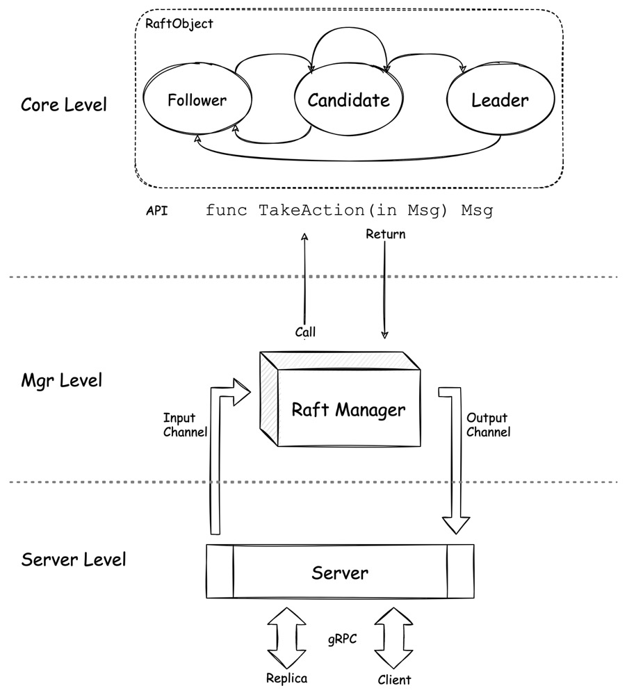

## Implementation of Raft by Golang

 

This project is an implementation of Raft algorithm by golang.

What is Raft ?
(the introduction below is from [Official Site of Raft](https://raft.github.io/))

Raft is a consensus algorithm that is designed to be easy to understand. It's equivalent to Paxos in fault-tolerance and performance. The difference is that it's decomposed into relatively independent subproblems, and it cleanly addresses all major pieces needed for practical systems. We hope Raft will make consensus available to a wider audience, and that this wider audience will be able to develop a variety of higher quality consensus-based systems than are available today.

> [Raft Paper](https://raft.github.io/raft.pdf)

### How to?
1. Run Server
   
   `go run run_server.go`

2. Run Client

   `go run client/run_client.go -leader=[leader host]:[port] -cmd=[command]`

### Architecture

### Unfinished Features
- [x] Config Change (only single node will be added or removed, for simplicity considering)
- [ ] Log Compaction
- [ ] Log Persistence
- [ ] Long-lived connection of gprc server 
- [x] Redirect to leader when follower received cmd request
- [ ] Error types arrangement
- [x] Introduce Cobra to client